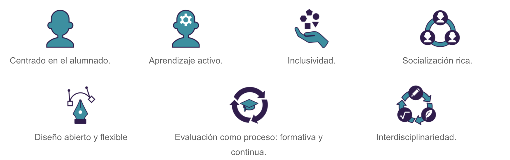

# ¿Qué se conoce como Aprendizaje Basado en Proyectos?

Según el Gobierno de Canarias: 
> El Aprendizaje basado en proyectos (ABP en adelante)es una estrategia metodológica de diseño y programación que implementa un conjunto de tareas basadas en la resolución de preguntas o problemas (retos), mediante un proceso de investigación o creación por parte del alumnado que trabaja de manera relativamente autónoma y con un alto nivel de implicación y cooperación y que culmina con un producto final presentado ante los demás (difusión). Una sociedad en continuo cambio requiere educar desde la incertidumbre a través de la experiencia y construyendo conocimientos compartidos generados desde la interacción y fomentando la autonomía. Quizás aquí radica la receta. El aprendizaje relevante y sostenible se desarrolla mediante el intercambio cultural con la creación compartida de la cultura en múltiples direcciones implementar una educación más activa centrada en “saber hacer”.

Las características principales del ABP se pueden resumir en la siguiente figura:

Por otro lado, los fundamentos claves del ABP son: 

1. Currículum integrado: se abordan diferentes disciplinas del currículo a través de un tema relevante y un eje conductor, incluyendo aprendizajes formales y no formales..

2. Protagonismo compartido: el Profesorado es aprendiz y no experto, y su función principal es crear los escenarios de aprendizaje que permitan que los estudiantes puedan desarrollar el proyecto. .

3. Inclusivo: se da respuesta a diferentes ritmos de aprendizajes, intereses y capacidades.

4. Parte de un reto: se parte de un tema atractivo que conecte los intereses del alumnado con los aprendizajes esperados para garantizar su motivación.

5. Evaluación y reflexión continua: el alumnado aprende a evaluarse y a ser evaluado para mejorar la calidad de los procesos y de los productos en los que trabaja.

6. Socialización y difusión: la experiencia de socialización se produce entre el alumnado y del alumnado con otros agentes educativos. El proyecto finaliza con la difusión pública de los productos.

En el [siguiente enlace](https://www.youtube.com/watch?v=HhWtDSbPo38) puedes encontrar un ejemplo o guía para ayudar al desarrollo de una unidad basada en el ABP.